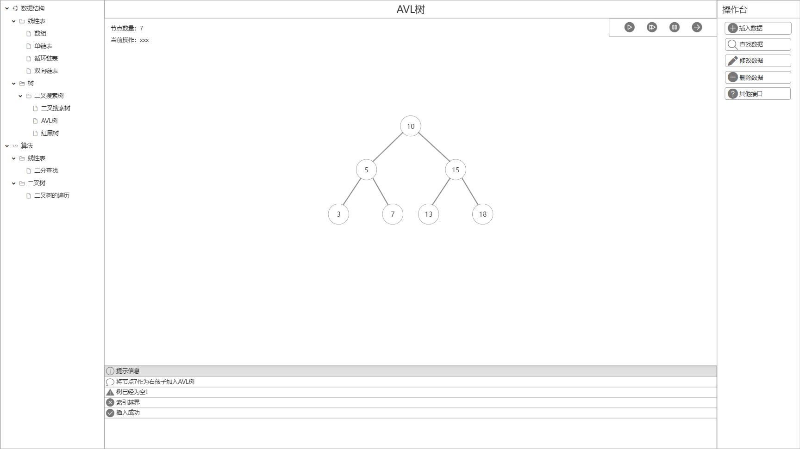
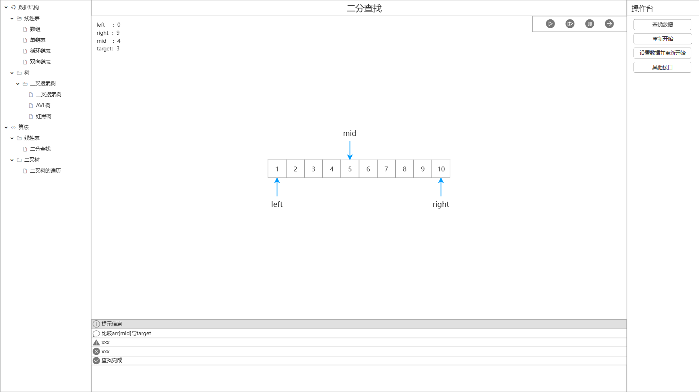

# 一、总体架构

项目分四层：算法层、流程控制层、可视化层、图形页面层。  
依赖关系：图形页面层 → 可视化层 → 算法层；流程控制层被算法层调用，由可视化层在每次复合操作前后置为暂停；图形页面层的流程控制按钮直接调用`StepController`的`setStatus`/`setTimeInterval`控制状态。

# 二、名词/功能介绍
- 任何数据结构的单个增删改查操作，称为“复合操作”
- 每个复合操作皆由多个插入/删除/旋转/交换等操作构成，它们统称为“原子操作”
- StepController在一个周期内，负责控制一个复合操作的多个原子操作：
  - 用户点击按钮执行一个复合操作时，弹出控制台，包含按钮“下一步/暂停/播放/快进”，初始状态为“暂停”
  - 用户点击“下一步”，执行一个原子操作并暂停
  - 用户点击“暂停”，停止执行
  - 用户点击“播放”，开始以PLAY_TIME_INTERVAL秒一个原子操作的速度执行
  - 用户点击“快进”，开始以FAST_TIME_INTERVAL秒一个原子操作的速度执行

# 三、可视化层/图形页面层工作任务
### 1. 图形页面层
- 用Vue3 + Vite搭建页面框架（见末尾），包括：
  - 数据结构选择菜单（列出线性表、栈、队列、BST、AVL、红黑树等）。
  - 输入区域：增删改查等操作控件。
  - 流程控制按钮：单步执行、播放、暂停、快进。
  - 消息展示区：显示算法执行过程中的提示信息（来自 MessageController）。
  - 画布区域：放置SVG容器，供D3渲染。
- 控件交互逻辑：
  - 点击边栏切换数据结构与算法
  - 点击增删改查按钮时调用可视化层暴露的接口
  - 点击流程控制按钮时调用StepController的`setStatus`方法设置状态（具体逻辑见StepController注释）。

### 2. 可视化层
- 实现各数据结构的图形化表示（数组、链表、树、图等），用D3绘制。
- 向node层注册原子操作回调（见“接口约定”第5条），在原子操作调用后触发D3过渡动画。
- 对数据结构类的原子操作进行动态代理（数据结构类实例也经`create`工厂创建，见“接口约定”第5条）
- 向图形页面层提供封装后的增删改查接口。
- 管理StepController单例，在每次复合操作开始/结束时均设置暂停状态。
- 管理MessageController单例，注册消息处理函数用于展示信息

注：第2、3条均为“对原子操作进行动态代理”，区别是前者的原子操作只依赖于单个节点（如设置值、删除等等），后者的原子操作依赖于完整的数据结构（如设置首尾指针等等）；两者均在通过`create`创建实例后自动生效。

## 四、接口约定

算法层/流程控制层提供以下接口：

1. **算法层**：
   - 数据结构类与节点类包含若干原子操作方法，约定这些方法的命名方式为：以下划线开头/分隔单词（如`_rotate_left`、`_set_color`等）需要由可视化层动态代理插入动画逻辑；
   - 数据结构类提供复合方法（如`insert`、`delete`，内部已用流程控制层方法划分为多个原子操作）；算法类（排序、查找、图算法、遍历等）没有原子方法，只提供异步复合入口（如`sort`、`find`、`search`、`getNext`、`execute`、`preOrderTraversal`等），均提供给可视化层调用。各算法类构造参数不同（如`new BinarySearch(data)`、`new KMP(str, template)`、`new kruskal(edges)`、`new BinaryTreeTraversal(root)`，排序类无参构造后调用`sort(data)`）。

2. **StepController接口**：  
   - `getStepController()`：获取单例。
   - `setStatus(number)`：改变流程控制状态（取值见`StepStatus`）。
   - `setTimeInterval(number)`：改变“播放”状态下原子操作的时间间隔（单位为秒，可传入导出的`PLAY_TIME_INTERVAL`/`FAST_TIME_INTERVAL`）
3. **MessageController接口**：  
   - `getMessageController()`：获取单例。
   - `setMessageHandler((msg: string, type: number) => void)`：注册消息处理函数。
     - `msg`为消息内容（警告/错误消息已自动加`[警告] `/`[错误] `前缀）；
     - `type`为消息种类（取值见`MessageType`：0普通、1警告、2错误、3成功），错误信息建议显示为红色，警告信息显示为橙色，普通信息显示为黑色。
4. **节点唯一ID**：所有数据结构的节点对象在创建时会分配唯一id（私有字段，通过`getId()`获取），用于D3的key函数；id计数器全局递增，图形页面层应在每次加载新页面时调用`DataNode.restart()`重置。
5. **原子操作代理（node层工厂）**：  
   由`node层`提供一个通用工厂`create(targetClass, ...args)`，统一负责节点与数据结构类的创建及原子操作的代理，可视化层无需侵入node代码：
   - **创建实例**：算法层不再直接`new`节点，而是调用`create(实例类, ...构造参数)`。`create`内部用`Proxy`包装实例后再返回，故之后对该实例的所有`_`开头方法的调用都会被拦截；数据结构类实例（如`create(LinkedList)`）同样经`create`创建。
   - **注册回调**：可视化层在页面加载时调用`setOpHook((target, method, args) => { ... })`注册一个统一回调；每次创建实例、或调用任一原子操作后，工厂都会以`(实例, 方法名, 参数)`调用该回调（创建实例时方法名为`"_create"`，参数为构造参数），可视化层在其中按`method`分发D3动画。回调在操作执行后触发，实例已是新状态。
   - **约定**：
     - 所有节点/数据结构类实例必须经`create`创建，直接`new`的实例不会被代理；
     - 被代理的实例在链表/树中传递的始终是同一对象，`instanceof`、`getId()`等行为不变；数据结构类实例没有`getId()`，可视化层可自行按实例类型分发；
     - 数据结构类构造期间的原子调用不会全部触发回调（此时代理尚未返回，如`_set_header`、`_set_head(null)`），个别节点级回调可能先于数据结构类的`_create`，首次渲染请直接读取实例状态；
     - 原子方法内部不得再调用其它原子方法（内部调用不会被拦截）。
6. **输入数组的所有权约定**：算法层直接持有页面传入的数组引用（如排序算法会原地交换`data`、`kruskal`会原地排序`edges`），这些数组会被原地修改；页面层如需保留原始输入，请在传入前自行拷贝。

# 五、设计图
## 主界面（数据结构）

- 左侧为菜单栏，用于选择数据结构/算法
- 中间为画布，用于展示数据结构的图形和动画
- 画布左上角为统计信息（如调用数据结构类的`size()`/`isEmpty()`获得）
- 画布右上角为单步流程控制面板，从左到右依次为播放、快进、暂停、单步执行
- 右侧为控制台，可以执行增删改查及其他操作
- 底部为信息窗口，用于展示算法执行过程中的产生的提示信息

## 主界面（算法）

- 同上